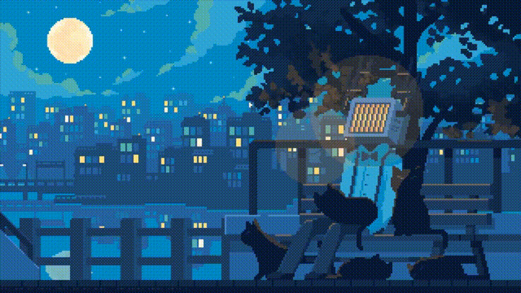

 

  

###

Hi  My name is Matvey
===============================================================================================================================

Back-End Developer
------------------

Я являюсь Back-End разработчиком, начинал свою карьеру уже с 14 лет, в то время еще обучаясь в школе заинтересовался строением сайтов и решил дома на компьютере накидать небольшой Front по гайду с ютуба, и, мне понравилось!

В дальнейшем мне стало интересно как устроена IT инфраструктура в целом, начал читать книги, смотреть курсы, узнал, как работать с базами данных и многое другое.

На 1 курсе обучения в колледже, неожиданно от преподавателя прилетел реальный заказ на создание Телеграм-бота для компании, я согласился! За буквально 2 дня, открыл для себя новый вид разработки ботов, и успешно закрыл первый заказ.

Теперь мне стал интересен Back и я решил для себя стать Back-End разработчиком.

------------------

I'm a back-end developer. I started my career at the age of 14. While still in school, I became interested in website development and decided to throw together a small front-end project at home using a YouTube guide. I loved it!

Later, I became interested in how IT infrastructure works in general, started reading books, watching courses, learned how to work with databases, and much more.

In my first year of college, a professor unexpectedly commissioned me to create a Telegram bot for a company. I accepted! In just two days, I discovered a new type of bot development and successfully completed my first order.

Now I've become interested in back-end development and decided to become a back-end developer.

------------------

* 🌍  I'm based in Russia
* ✉️  You can contact me at [workpost.matvey@gmail.com](mailto:workpost.matvey@gmail.com)
* 🧠  I'm currently learning a new programming language
* 👥  I'm looking to collaborate on interesting project

###

  <picture>
    <source media="(prefers-color-scheme: dark)" srcset="https://raw.githubusercontent.com/Flowseal/Flowseal/refs/heads/output/github-contribution-grid-snake-dark.svg" />
    <source media="(prefers-color-scheme: light)" srcset="https://raw.githubusercontent.com/Flowseal/Flowseal/refs/heads/output/github-contribution-grid-snake.svg" />
    
  </picture>

###

<h3 align="left">🛠 Technologies:</h3>

###

  
  
  
  
  
  
  
  
  
  
  
  
  
  
  
  
  

###

  
  
  
  
  
  
  
  
  
  
  

###

  
  
  
  
  
  
  

### Socials

 <a href="https://www.github.com/TessEndGrad" target="_blank" rel="noreferrer"> <picture> <source media="(prefers-color-scheme: dark)" srcset="https://raw.githubusercontent.com/danielcranney/readme-generator/main/public/icons/socials/github-dark.svg" /> <source media="(prefers-color-scheme: light)" srcset="https://raw.githubusercontent.com/danielcranney/readme-generator/main/public/icons/socials/github.svg" />  </picture> </a> <a href="https://discord.com/users/gradusnb" target="_blank" rel="noreferrer"> <picture> <source media="(prefers-color-scheme: dark)" srcset="https://raw.githubusercontent.com/danielcranney/readme-generator/main/public/icons/socials/discord-dark.svg" /> <source media="(prefers-color-scheme: light)" srcset="https://raw.githubusercontent.com/danielcranney/readme-generator/main/public/icons/socials/discord.svg" />  </picture> </a>

